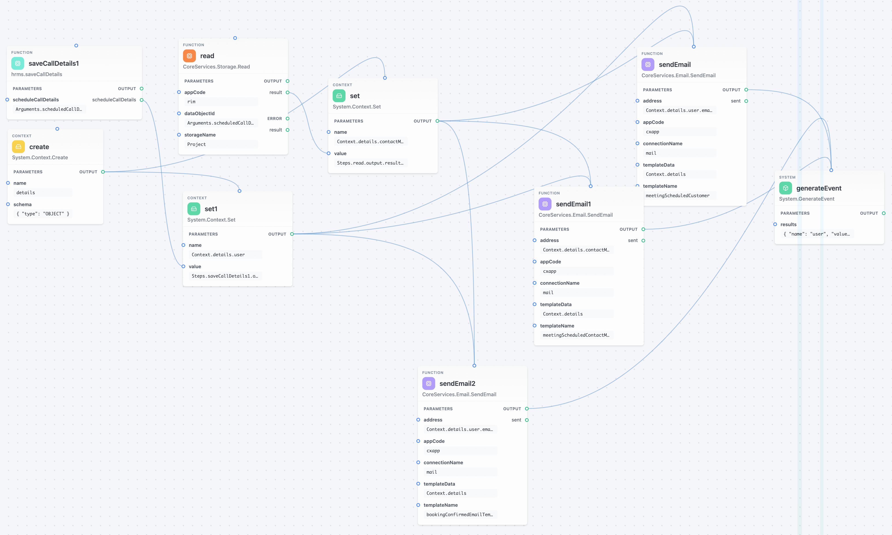

# KIRun - Kinetic Instruction Runtime

<p align="center">
  <strong>A polyglot visual code execution engine for no-code/low-code platforms</strong>
</p>

<p align="center">
  <a href="#installation">Installation</a> •
  <a href="#what-is-kirun">What is KIRun?</a> •
  <a href="#quick-start">Quick Start</a> •
  <a href="./kirun-docs/">Documentation</a> •
  <a href="#license">License</a>
</p>

<p align="center">
  
  
  
  
  
</p>

---

<p align="center">
  
  <br>
  <em>Visual node editor for building function graphs</em>
</p>

---

## What is KIRun?

**KIRun** is a cross-platform interpreter that executes JSON-defined function graphs. Define your logic once as a JSON workflow and run it identically on Java (server) or JavaScript/TypeScript (browser/Node.js).

It is the execution backbone of the [Modlix](https://modlix.com) no-code platform.

### Key Capabilities

- **Polyglot** - Same JSON definition runs on Java and JavaScript
- **Graph-based execution** - Automatic dependency resolution and parallel execution
- **Expression engine** - Arithmetic, logical, bitwise, ternary, and nullish coalescing operators
- **120+ built-in functions** - Arrays, strings, math, dates, objects, loops, context, and JSON
- **JSON Schema validation** - Type-safe parameter validation
- **Event-driven** - Branching workflows with custom events
- **DSL support** - Human-readable text format that compiles to/from JSON
- **Debug mode** - Full execution tracing with step-by-step logging
- **Extensible** - Custom function and schema repositories

---

## Installation

### Java (Maven)

```xml
<dependency>
    <groupId>com.fincity.nocode</groupId>
    <artifactId>kirun-java</artifactId>
    <version>4.3.0</version>
</dependency>
```

### JavaScript/TypeScript (npm)

```bash
npm install @fincity/kirun-js
```

---

## Quick Start

### JavaScript/TypeScript

```typescript
import {
    FunctionDefinition,
    KIRuntime,
    FunctionExecutionParameters,
    KIRunFunctionRepository,
    KIRunSchemaRepository,
} from '@fincity/kirun-js';

// Load a function definition from JSON
const fd = FunctionDefinition.from({
    name: 'addNumbers',
    namespace: 'MyApp',
    parameters: {
        a: { parameterName: 'a', schema: { type: ['INTEGER'] } },
        b: { parameterName: 'b', schema: { type: ['INTEGER'] } },
    },
    events: {
        output: {
            name: 'output',
            parameters: { result: { type: ['INTEGER'] } },
        },
    },
    steps: {
        add: {
            statementName: 'add',
            namespace: 'System.Math',
            name: 'Add',
            parameterMap: {
                value: {
                    one: { key: 'one', type: 'EXPRESSION', expression: 'Arguments.a', order: 1 },
                    two: { key: 'two', type: 'EXPRESSION', expression: 'Arguments.b', order: 2 },
                },
            },
        },
        genOutput: {
            statementName: 'genOutput',
            namespace: 'System',
            name: 'GenerateEvent',
            parameterMap: {
                eventName: {
                    one: { key: 'one', type: 'VALUE', value: 'output', order: 1 },
                },
                results: {
                    result: {
                        key: 'result',
                        type: 'EXPRESSION',
                        expression: 'Steps.add.output.value',
                        order: 1,
                    },
                },
            },
            dependentStatements: { 'Steps.add.output': true },
        },
    },
});

// Execute
const runtime = new KIRuntime(fd);
const fep = new FunctionExecutionParameters(
    new KIRunFunctionRepository(),
    new KIRunSchemaRepository(),
).setArguments(new Map([['a', 5], ['b', 3]]));

const result = await runtime.execute(fep);
console.log(result.allResults()); // result = 8
```

### Java

```java
ReactiveKIRuntime runtime = new ReactiveKIRuntime(functionDefinition);
FunctionExecutionParameters fep = new FunctionExecutionParameters(
    new KIRunReactiveFunctionRepository(),
    new KIRunReactiveSchemaRepository()
);

runtime.execute(fep)
    .subscribe(result -> System.out.println(result));
```

---

## Project Structure

| Module                   | Description                    | Version |
| ------------------------ | ------------------------------ | ------- |
| [kirun-java](./kirun-java/) | Java runtime (Project Reactor) | 4.3.0   |
| [kirun-js](./kirun-js/)     | JavaScript/TypeScript runtime  | 3.3.0   |
| [kirun-ui](./kirun-ui/)     | Visual editor components       | -       |
| [kirun-go](./kirun-go/)     | Go runtime (experimental)      | -       |

---

## Documentation

Full documentation is available in the [kirun-docs/](./kirun-docs/) directory:

- [Architecture](./kirun-docs/architecture.md) - Core concepts and execution model
- [Expression Engine](./kirun-docs/expressions.md) - Expression syntax and operators
- [Built-in Functions](./kirun-docs/functions.md) - Complete function reference
- [Schema &amp; Types](./kirun-docs/schemas.md) - Type system and validation
- [Custom Functions](./kirun-docs/custom-functions.md) - Building your own functions
- [DSL](./kirun-docs/dsl.md) - Human-readable text format
- [Debug Mode](./kirun-docs/debugging.md) - Execution tracing and debugging

---

## Build

```bash
# Java
cd kirun-java && ./mvnw clean install

# JavaScript
cd kirun-js && npm install && npm run build

# Tests
cd kirun-java && ./mvnw test
cd kirun-js && npm test
```

---

## License

MIT License - see [LICENSE](LICENSE) for details.

---

## Links

- **Repository**: [github.com/modlix-india/nocode-kirun](https://github.com/modlix-india/nocode-kirun)
- **Java Package**: [Maven Central](https://central.sonatype.com/artifact/com.fincity.nocode/kirun-java)
- **npm Package**: [@fincity/kirun-js](https://www.npmjs.com/package/@fincity/kirun-js)

---

<p align="center">
  Built with care by <a href="https://modlix.com">Modlix</a>
</p>
