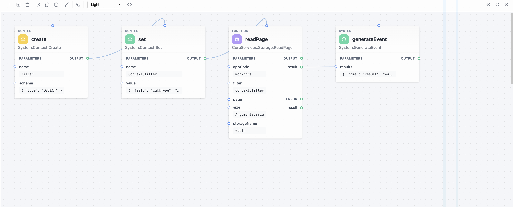
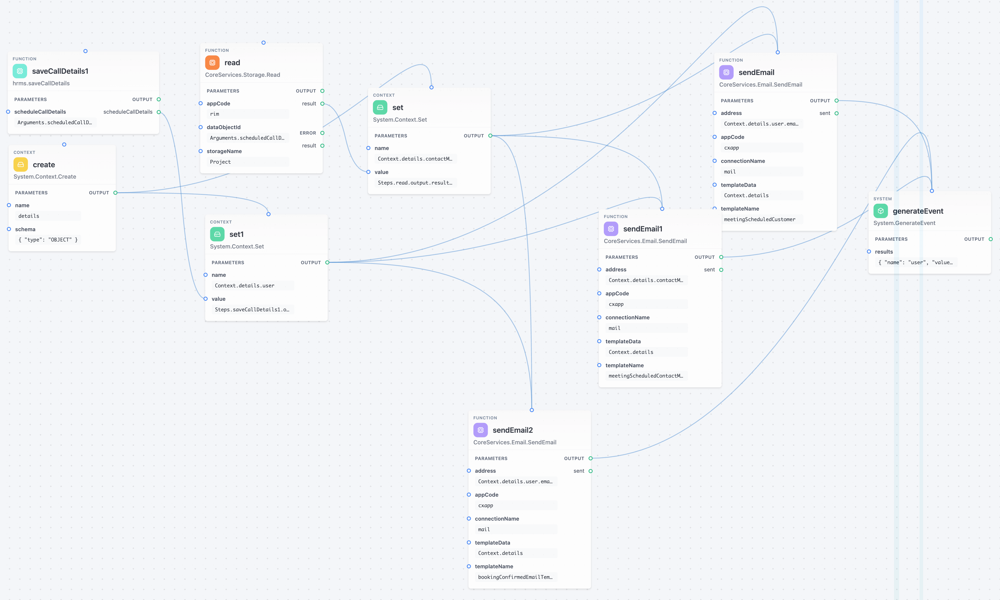

# Architecture

KIRun is a graph-based execution engine that interprets JSON-defined function definitions. This document covers the core concepts, data model, and execution lifecycle.

## Visual Editor

KIRun functions can be built and edited visually using the node-based editor. Each step is a node in the graph, and connections between nodes represent data flow and dependencies.



*A simple function with 4 connected steps: create → set → readPage → generateEvent.*

As functions grow, the graph naturally scales. Here is a medium-complexity function handling email notifications with context setup, reads, and multiple send paths:



*A medium-complexity function with ~8 steps including context creation, data reads, conditional email sending, and event generation.*

Real-world production functions can become quite large. The visual editor handles complex graphs with many interconnected steps:


*A production-scale function with 30+ steps spanning multiple branches and dependencies.*

### Adding Steps

New steps can be added via the search popup, which provides autocomplete across all available functions (built-in and custom):


*The step search popup showing available functions with descriptions. Functions are organized by namespace.*

### Editing Step Parameters

Each step's parameters can be configured through a form panel. Parameters support both static values and dynamic expressions:


*The parameter editor for a step, showing form fields with expression/value toggles for each parameter.*

## Core Concepts

### FunctionDefinition

A `FunctionDefinition` is the top-level unit of execution. It describes a complete function as a directed acyclic graph (DAG) of steps.

```
FunctionDefinition
├── name           → "calculateTotal"
├── namespace      → "MyApp"
├── parameters     → Input parameters with schemas
├── events         → Output events with schemas
├── steps          → Map of Statement nodes (the execution graph)
├── stepGroups     → Optional grouping of statements
├── parts          → Sub-function definitions (composable)
└── version        → Definition version number
```

### Statements (Steps)

Each step in the function is a `Statement` that calls another function (built-in or custom). Statements form the nodes of the execution graph.

```
Statement
├── statementName        → Unique identifier within the function
├── namespace            → Namespace of the function to call
├── name                 → Name of the function to call
├── parameterMap         → How to bind parameters (values or expressions)
├── dependentStatements  → Which steps must complete before this one runs
├── executeIftrue        → Conditional execution based on dependent step events
├── comment              → Optional developer comment
├── description          → Optional description
└── position             → Visual editor position (x, y)
```

### Parameters

Parameters define the inputs to a function with type validation via JSON Schema.

```typescript
Parameter
├── parameterName    → "userId"
├── schema           → Schema definition (type, constraints)
├── variableArgument → Whether it accepts multiple values (varargs)
└── type             → EXPRESSION or CONSTANT
```

There are two parameter types:

| Type | Description |
|------|-------------|
| `EXPRESSION` | Value is resolved at runtime via the expression engine |
| `CONSTANT` | Value is used as-is (no expression evaluation) |

### Events

Events are the output channels of a function. Every function emits at least one event.

| Event Name | Purpose |
|------------|---------|
| `output` | Standard successful result |
| `error` | Error information |
| `iteration` | Loop iteration data |
| `true` / `false` | Conditional branching (from `If`) |

```typescript
Event
├── name       → "output"
└── parameters → Map of output schemas
```

### ParameterReference

A `ParameterReference` binds a value to a function parameter within a step. It specifies where the value comes from.

```
ParameterReference
├── key        → Unique key for this binding
├── type       → VALUE or EXPRESSION
├── value      → Static value (when type is VALUE)
├── expression → Expression string (when type is EXPRESSION)
└── order      → Ordering for variable arguments
```

## Execution Flow

```
 JSON Definition
       │
       ▼
 ┌─────────────┐
 │   Parse      │ ── FunctionDefinition.from(json)
 └─────┬───────┘
       │
       ▼
 ┌─────────────┐
 │   Plan       │ ── Build ExecutionGraph with dependency analysis
 └─────┬───────┘
       │
       ▼
 ┌─────────────┐
 │  Validate    │ ── Check parameters against schemas
 └─────┬───────┘
       │
       ▼
 ┌─────────────┐
 │  Execute     │ ── Run steps in topological order
 └─────┬───────┘    (parallel execution where possible)
       │
       ▼
 ┌─────────────┐
 │  Output      │ ── Emit events and return results
 └─────────────┘
```

### 1. Parse

The JSON definition is deserialized into a `FunctionDefinition` object:

```typescript
// JavaScript
const fd = FunctionDefinition.from(jsonObject);

// Or from DSL text
const fd = await FunctionDefinition.fromText(dslString);
```

```java
// Java
FunctionDefinition fd = new Gson().fromJson(jsonString, FunctionDefinition.class);
```

### 2. Plan (Execution Graph)

The runtime analyzes step dependencies and builds an `ExecutionGraph`. Dependencies come from:

- **Explicit dependencies** - `dependentStatements` map on each step
- **Implicit dependencies** - Expression references like `Steps.stepName.output.value`

The graph ensures:
- Steps without dependencies can execute in parallel
- Circular dependencies are detected and rejected
- All referenced steps exist

### 3. Validate

Parameters are validated against their JSON Schema definitions before execution. This ensures type safety at runtime boundaries.

### 4. Execute

Steps execute in dependency order. For each step:

1. Resolve all parameter values (evaluate expressions against current context)
2. Look up the function from the repository
3. Execute the function with resolved parameters
4. Store results in the step output map
5. Emit events

The execution context provides these token value extractors for expression resolution:

| Prefix | Description | Example |
|--------|-------------|---------|
| `Arguments.` | Function input parameters | `Arguments.userId` |
| `Steps.` | Output from completed steps | `Steps.fetch.output.data` |
| `Context.` | Context variables (created via `System.Context.Create`) | `Context.myVar` |

### 5. Output

Functions communicate results through events. The most common pattern:

```json
{
    "statementName": "generateOutput",
    "namespace": "System",
    "name": "GenerateEvent",
    "parameterMap": {
        "eventName": {
            "one": { "key": "one", "type": "VALUE", "value": "output" }
        },
        "results": {
            "result": {
                "key": "result",
                "type": "EXPRESSION",
                "expression": "Steps.compute.output.value"
            }
        }
    }
}
```

## Stopping and resuming an execution

*Java runtime only (`ReactiveKIRuntime`).*

An execution normally runs from its first step to its last in one go. A workflow cannot: "wait three
days, then send the follow-up" has to outlive the request, the process, and any execution timeout the
host imposes. So a step can instead **stop** the execution, hand back a serialisable snapshot, and
let the host **resume** it later.

### How a stop surfaces

A stopping step - `System.WaitUntil` or `System.WaitForSignal` - raises the reserved `suspended`
event. Like `output` it ends the enclosing graph, but unlike every other non-output event it does not
open a branch. `execute()` still returns a `FunctionOutput`, so nothing that calls the runtime today
needs to change; a host that cares looks for the event:

```java
ReactiveFunctionExecutionParameters params =
        new ReactiveFunctionExecutionParameters(fRepo, sRepo);

FunctionOutput output = runtime.execute(params).block();

SuspendedExecution state = params.getSuspension();   // null when it ran to completion
```

The event itself carries only the execution id and the wake condition, so it stays small enough to
return over HTTP. The full snapshot is left on the execution parameters the caller already owns.

### The snapshot

`SuspendedExecution` holds the arguments, context, step outputs, raised events and execution context,
plus one **frame** per nested graph level recording what that level still had left to do. The
execution graph is deliberately not stored - it is rebuilt from the definition on resume and vertices
are found again by statement name, so a snapshot stays valid across a redeploy.

Everything in it is a `JsonElement` or a primitive, so `SuspendedExecutionSerializer` round-trips it
to JSON for a host to park in a database.

Stopping inside a loop body works because loop positions live in the execution context rather than in
the generator's closure (see `LoopCursor`), and so travel with the snapshot. Stopping inside a nested
function call works too: that inner activation's own snapshot hangs off `child`, and the chain of
children is the call stack at the moment it stopped.

### Resuming

```java
runtime.resume(state, Map.of("token", new JsonPrimitive("abc")), false, fRepo, sRepo, hostExtractors)
```

The step that stopped is **not** run again - its result is seeded from the resume payload, so a wait
cannot stop the execution again the instant it comes back. Later steps read that payload through
`Steps.<waitStep>.output`. Pass `timedOut = true` to resume a `WaitForSignal` down its `timeout`
event instead of `output`.

The host must supply what the snapshot deliberately does not carry: the function and schema
repositories, and any token value extractors of its own that the definition's expressions refer to.
The iteration guard's count starts again on each resume, so a long-lived journey does not trip the
infinite-loop check merely for having been resumed often.

### Persistence and scheduling are the host's

The runtime owns no clock and no store - a day-scale wait cannot be a live subscription. It defines
the two contracts and leaves the implementations to the host:

| Interface | Responsibility |
|-----------|----------------|
| `ExecutionStateStore` | Save, load and delete snapshots by execution id |
| `ResumeScheduler` | Arrange the wake-up for a `WakeCondition`, and cancel it |

`InMemoryExecutionStateStore` implements the first for tests and for hosts that want the mechanics
without durability.

### Limits

- Only one step may stop an execution per pass. Two waits with nothing ordering them are dispatched
  concurrently, and an execution stopped in two places has no single point to resume from, so this is
  refused with an error rather than silently losing one.
- A step that owns a branch is executed again when the branch is rebuilt on resume. That is safe for
  `If` and the loops; a side-effecting function used that way would run its side effect twice.
- Non-deterministic expressions (`System.Math.Random`, the current time) re-evaluate on resume if
  they feed a branch-owning step's arguments.

## Runtime Implementations

### JavaScript/TypeScript (`KIRuntime`)

Uses `async/await` for non-blocking execution:

```typescript
const runtime = new KIRuntime(fd, debugMode);
const result = await runtime.execute(fep);
```

### Java (`ReactiveKIRuntime`)

Uses Project Reactor for fully reactive execution:

```java
ReactiveKIRuntime runtime = new ReactiveKIRuntime(fd, debugMode);
Mono<FunctionOutput> result = runtime.execute(fep);
```

## Repository Pattern

KIRun uses repositories to look up functions and schemas at runtime. This is how the engine finds both built-in and custom functions.

```typescript
interface Repository<T> {
    find(namespace: string, name: string): Promise<T | undefined>;
    filter(name: string): Promise<string[]>;
}
```

### Built-in Repositories

| Repository | Description |
|------------|-------------|
| `KIRunFunctionRepository` | All built-in KIRun functions |
| `KIRunSchemaRepository` | All built-in KIRun schemas |

### HybridRepository

Combine multiple repositories (e.g., built-in + custom):

```typescript
const repo = new HybridRepository<Function>(
    new KIRunFunctionRepository(),
    new CustomFunctionRepository(),
);
```

The hybrid repository tries each inner repository in order until a match is found.

## Namespaces

Functions and schemas are organized into namespaces:

| Namespace | Contents |
|-----------|----------|
| `System` | Core functions (If, GenerateEvent, Print, Wait, Make, ValidateSchema) |
| `System.Math` | Mathematical operations |
| `System.String` | String manipulation |
| `System.Array` | Array operations |
| `System.Object` | Object manipulation |
| `System.Date` | Date/time operations |
| `System.Loop` | Loop constructs |
| `System.Context` | Runtime context management |
| `System.Json` | JSON parse/stringify |

## Dependency Resolution

### Explicit Dependencies

Use `dependentStatements` to declare ordering:

```json
{
    "statementName": "step2",
    "dependentStatements": {
        "Steps.step1.output": true
    }
}
```

The key format is `Steps.<statementName>.<eventName>`. The boolean value is used with `executeIftrue` for conditional execution.

### Conditional Execution

The `executeIftrue` map determines which dependency events trigger execution:

```json
{
    "statementName": "onSuccess",
    "dependentStatements": {
        "Steps.check.true": true
    },
    "executeIftrue": {
        "Steps.check.true": true
    }
}
```

This step only executes when the `check` step emits a `true` event (e.g., from an `If` function).

## Function Composition

Functions can be composed by:

1. **Step references** - One step's output feeds into another step's parameters via expressions
2. **Parts** - A `FunctionDefinition` can contain sub-definitions in the `parts` array
3. **Custom repositories** - Register your own function definitions as reusable functions
