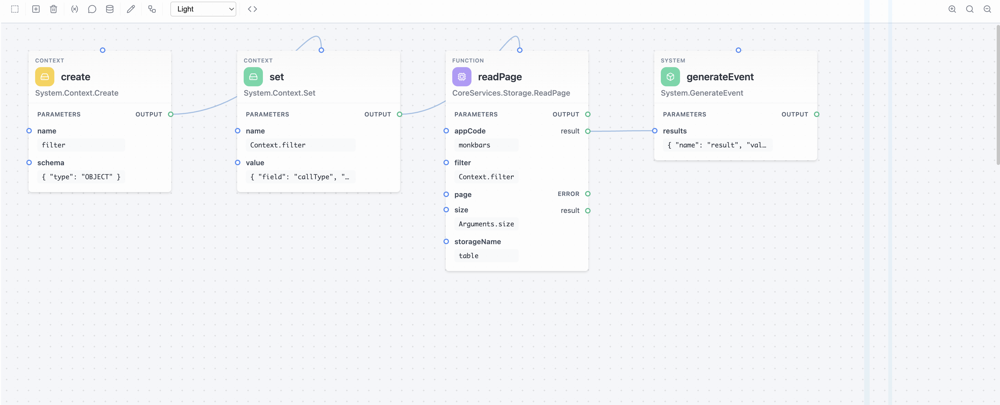
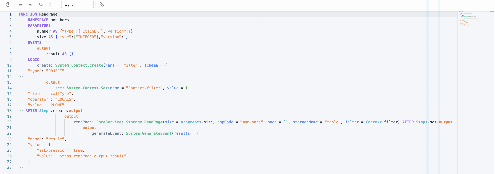

# Visual Editor (kirun-ui)

`@fincity/kirun-ui` is a React component library that provides a visual node-based editor and a text-based DSL editor for building and editing KIRun function definitions.


## Installation

```bash
npm install @fincity/kirun-ui
```

### Peer Dependencies

| Package | Version | Purpose |
|---------|---------|---------|
| `@fincity/kirun-js` | `>=3.0.0` | Runtime library (FunctionDefinition, Repository, Schema) |
| `monaco-editor` | `>=0.40.0` | Text editor for DSL mode |
| `react` | `>=17.0.0` | UI framework |
| `react-dom` | `>=17.0.0` | DOM binding |

```bash
npm install @fincity/kirun-js monaco-editor react react-dom
```

### Import Styles

The editor ships with its own CSS that must be imported:

```typescript
import '@fincity/kirun-ui/dist/kirun-ui.css';
```

## Quick Start

```tsx
import { KIRunEditor } from '@fincity/kirun-ui';
import { KIRunFunctionRepository, KIRunSchemaRepository } from '@fincity/kirun-js';
import '@fincity/kirun-ui/dist/kirun-ui.css';

function MyEditor() {
    const [definition, setDefinition] = useState(initialDefinition);

    return (
        <KIRunEditor
            functionDefinition={definition}
            onChange={setDefinition}
            functionRepository={new KIRunFunctionRepository()}
            schemaRepository={new KIRunSchemaRepository()}
        />
    );
}
```

## KIRunEditor Props

### Required Props

| Prop | Type | Description |
|------|------|-------------|
| `functionRepository` | `Repository<Function>` | Repository for resolving function references. Use `KIRunFunctionRepository` for built-in functions, or `HybridRepository` to combine built-in with custom functions. |
| `schemaRepository` | `Repository<Schema>` | Repository for resolving schema references. Use `KIRunSchemaRepository` for built-in schemas. |

### Data Binding

| Prop | Type | Description |
|------|------|-------------|
| `functionDefinition` | `any` | The raw JSON function definition object to edit |
| `onChange` | `(def: any) => void` | Called whenever the definition changes |
| `readOnly` | `boolean` | Disable editing (default: `false`) |
| `functionKey` | `string` | Unique key identifying this function (used for internal state) |

### Expression Context

| Prop | Type | Description |
|------|------|-------------|
| `tokenValueExtractors` | `Map<string, TokenValueExtractor>` | Custom token value extractors for expression resolution |
| `stores` | `string[]` | Store names to display in the editor |
| `storePaths` | `Set<string>` | Known store paths for autocomplete suggestions |
| `hideArguments` | `boolean` | Hide the Arguments panel |

### Debug Mode

| Prop | Type | Description |
|------|------|-------------|
| `debugViewMode` | `boolean` | Enable debug visualization |
| `executionLog` | `ExecutionLog` | Execution log data to display on statements |

### Personalization

| Prop | Type | Description |
|------|------|-------------|
| `personalization` | `PersonalizationData` | Editor preferences (zoom, theme, mode, etc.) |
| `onPersonalizationChange` | `(data: PersonalizationData) => void` | Called when user changes editor preferences |

### Clipboard

| Prop | Type | Description |
|------|------|-------------|
| `onCopy` | `(data: string) => void` | Custom copy handler for statements |
| `onPaste` | `() => Promise<string \| undefined>` | Custom paste handler for statements |

### Styling

| Prop | Type | Description |
|------|------|-------------|
| `className` | `string` | Additional CSS class name |
| `style` | `CSSProperties` | Inline styles |

## Personalization

The editor supports persistent user preferences via the `PersonalizationData` interface:

```typescript
interface PersonalizationData {
    magnification?: number;       // Zoom level (default: 1)
    showComments?: boolean;       // Show step comments
    showStores?: boolean;         // Show store nodes
    showParamValues?: boolean;    // Show parameter values on nodes
    textEditorTheme?: EditorTheme; // Text editor theme
    textEditorWordWrap?: 'on' | 'off';
    editorMode?: 'visual' | 'text'; // Which editor mode to show
}
```

### Editor Themes

The text editor ships with 5 built-in themes:

| Theme | Description |
|-------|-------------|
| `light` | Light background, dark text |
| `dark` | Dark background, light text |
| `high-contrast` | High contrast for accessibility |
| `easy-on-eyes` | Muted colors, reduced strain |
| `flared-up` | Vibrant, colorful syntax highlighting |

## Editor Modes

The editor supports two modes that users can switch between:

### Visual Mode (Graph Editor)

The visual mode presents function definitions as a node graph where each step is a draggable node connected by dependency lines.



Features:
- Drag-and-drop statement positioning
- Dependency lines drawn automatically (SVG)
- Multi-select with Shift+click or drag-select
- Zoom with pinch or +/- shortcuts
- Right-click context menu for statement operations
- Auto-layout based on dependency analysis

### Text Mode (DSL Editor)

The text mode uses a Monaco Editor instance with full KIRun DSL support.



Features:
- Syntax highlighting for KIRun DSL keywords
- Autocomplete for function names, parameters, and keywords
- Real-time validation with error/warning markers
- Code formatting
- Find & Replace
- Word wrap toggle
- Integrated DSL help window

## Adding Steps

New steps can be added through the search popup. Type to filter across all available functions from both built-in and custom repositories:


Functions are organized by namespace and include descriptions when available.

## Editing Step Parameters

Each step's parameters are configured through a form panel. Parameters support both static values and dynamic expressions with a toggle:


## Integration with Custom Repositories

For applications with custom functions, use `HybridRepository` to combine built-in and custom function sources:

```tsx
import { KIRunEditor } from '@fincity/kirun-ui';
import {
    KIRunFunctionRepository,
    KIRunSchemaRepository,
    HybridRepository,
} from '@fincity/kirun-js';

const functionRepo = new HybridRepository(
    new KIRunFunctionRepository(),
    myCustomFunctionRepository,
);

const schemaRepo = new HybridRepository(
    new KIRunSchemaRepository(),
    myCustomSchemaRepository,
);

<KIRunEditor
    functionDefinition={definition}
    onChange={setDefinition}
    functionRepository={functionRepo}
    schemaRepository={schemaRepo}
/>
```

## Debug View

When `debugViewMode` is enabled with an `executionLog`, the editor overlays execution data on each statement node - showing arguments, results, timing, and errors for each step.

```tsx
import { DebugCollector } from '@fincity/kirun-js';

const collector = DebugCollector.getInstance();
const executionLog = collector.getLastExecution();

<KIRunEditor
    functionDefinition={definition}
    onChange={setDefinition}
    functionRepository={functionRepo}
    schemaRepository={schemaRepo}
    debugViewMode={true}
    executionLog={executionLog}
/>
```

See [Debug Mode](./debugging.md) for more on the `DebugCollector` API.

## Exported Utilities

Beyond the main editor, `@fincity/kirun-ui` exports several standalone components and utilities:

### SchemaForm

A standalone form generator that renders editable forms from JSON schemas:

```tsx
import { SchemaForm } from '@fincity/kirun-ui';

<SchemaForm
    schema={mySchema}
    value={currentValue}
    onChange={(newValue) => setValue(newValue)}
/>
```

Supports string, number, boolean, array, object, and any-type editors with recursive nesting.

### Function Documentation

Browse and search the built-in function documentation:

```tsx
import {
    FunctionDocumentationViewer,
    FunctionDetailModal,
    initializeDocumentation,
    searchFunctionDocumentation,
    getFunctionsByTopLevelNamespace,
} from '@fincity/kirun-ui';

// Initialize docs (lazy-loaded, call once)
await initializeDocumentation();

// Search
const results = searchFunctionDocumentation('array sort');

// Browse by namespace
const grouped = getFunctionsByTopLevelNamespace();

// React component
<FunctionDocumentationViewer />
```

### Auto Layout

Automatically position statements based on their dependency graph:

```typescript
import { autoLayoutFunctionDefinition } from '@fincity/kirun-ui';

const layoutedDefinition = autoLayoutFunctionDefinition(functionDefinition);
```

### Markdown Renderer

Render markdown content as React elements:

```tsx
import { MarkdownRenderer } from '@fincity/kirun-ui';

<MarkdownRenderer content="## Hello\n\nSome **bold** text" />
```

## Full Example

A complete integration showing all major features:

```tsx
import { useState } from 'react';
import { KIRunEditor, PersonalizationData } from '@fincity/kirun-ui';
import {
    KIRunFunctionRepository,
    KIRunSchemaRepository,
    HybridRepository,
} from '@fincity/kirun-js';
import '@fincity/kirun-ui/dist/kirun-ui.css';

function FunctionEditor({ initialDefinition, customFunctionRepo, onSave }) {
    const [definition, setDefinition] = useState(initialDefinition);
    const [personalization, setPersonalization] = useState<PersonalizationData>({
        editorMode: 'visual',
        magnification: 1,
        showComments: true,
        showParamValues: true,
        textEditorTheme: 'dark',
    });

    const functionRepo = new HybridRepository(
        new KIRunFunctionRepository(),
        customFunctionRepo,
    );

    return (
        <div style={{ width: '100%', height: '100vh' }}>
            <KIRunEditor
                functionDefinition={definition}
                onChange={(def) => {
                    setDefinition(def);
                    onSave(def);
                }}
                functionRepository={functionRepo}
                schemaRepository={new KIRunSchemaRepository()}
                personalization={personalization}
                onPersonalizationChange={setPersonalization}
            />
        </div>
    );
}
```
